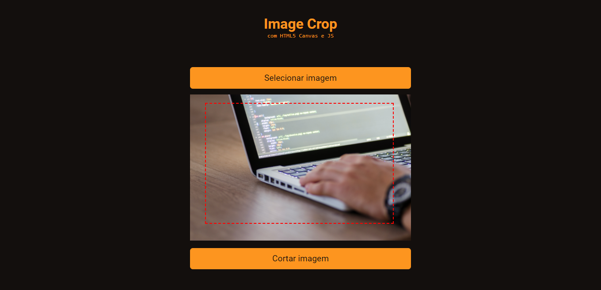

# Image Crop
**Aplicação web que permite o corte de imagens e download de nova versão**

Para a construção de tal aplicação fiz manipulação da DOM e utilizamos o Canvas, elemento do HTML5 que permite a renderização dinâmica de gráficos. Este é um projeto do *Code Drops*, da [Rocketseat](https://rocketseat.com.br/). 
OBS.: o projeto utiliza puramente o **HTML, CSS e JavaScript**, sem adição de bibliotecas, frameworks e afins.

#### Quer dar uma olhadinha no resultado? :eyes:

Esqueci de perguntar, você quer acessar e testar você mesmo(a)? É só [clicar aqui](https://imagecropjavascript.netlify.app/).

<h4 align="center">Orgulhosamente feito por Allan Kildare</h4>
